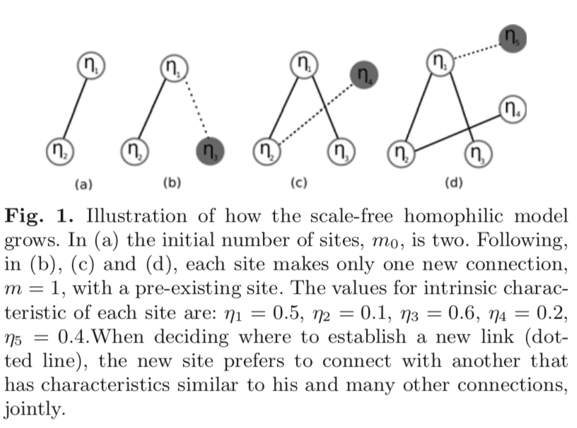
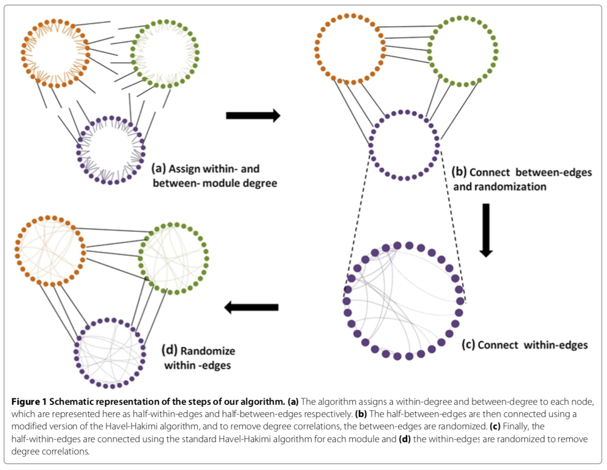

---
header-includes:
- \usepackage{physics}
- \usepackage{sectsty} \sectionfont{\centering}
output: pdf_document
---

# PROTOCOL FOR: 
# Sex-assortativity and the spread of TB on contact networks

_Spring 2019_

## Authors: 

* Paige Miller
* John Drake
* TBD

### Background: 

TB is a respiratory-transmitted infectious disease that is heterogeneously distributed globally and concentrated in Africa and Asia. In addition, TB is heterogeneously distributed among groups within populations; in particular, men face higher risk factors than women. The global male:female TB case ratio is 1.9, a pattern strikingly consistent across countries. 

Male-bias in TB case reports is thought to be due to sex-specific differences in exposure to Mtb or susceptibility to disease following exposure, or a combination of the two. Exposure rates could be mediated by differences in behaviors and societal gender roles. For example males may have more contacts or be more central in social networks though previous studies have failed to substantiate this (Miller et al. _in prep_ , Mossong et al. 2008, etc.). Alternatively, sex-specific exposure rates could be driven by differences in the types of contacts that males have in comparison to females. Specifically, exposure could be higher in males due to assortative mixing which is where individuals tend to associate with others similar to them, creating sub-groups within a social network. However, we lack studies analyzing the role of hypothesized exposure mechanisms at driving male-bias. Indeed, more studies identify sex-specific susceptibility (smoking, hormones, genetics, immunology) as the key component driving male bias. 

We wondered whether the types of contacts that men have, specifically their preferential social mixing with other men, could contribute to male-bias in TB case reports per se or if previously described differences in susceptibility between the sexes are necessary to explain male-bias

### Research questions:

1. Can sex-assortative mixing lead to observed levels of overall TB prevalence and sex-specific TB prevalence?
2. Are sex-specific differences in susceptibility required to explain male-bias in TB cases? 

### Study design: 

We will examine the effects of sex-assortativity and sex-specific susceptibility on the ratio of male to female cases using models of disease spread on simulated networks. 

In the simulated networks, each node will represent an individual and each link is a connection between individuals that infection can spread. 

Simulated networks will vary in level of sex-assortativity, r, calculated according to Newman (2003) as follows. If $e_{ij}=$Prob(edge type ij) and $E=[e_{ij}]$ then $\sum_{ij}{e_{ij}=1}$. Also, let $Tr \textbf{E}$ be the fraction of edges within-sex and $||E^2||$ be the fraction of edges that would be within groups if connections were random. Then, the level of assortativity in the network is

\[ r = \frac{Tr \textbf{E} - ||E^2||}{1 - ||E^2||} \]

A pilot study (Table 1) will be undertaken prior to epidemic simulations to determine the feasibility of different methods (described below as _option 1_, _option 2_, _option 3_) to generate networks that follow a power-law degree distribution overall.

| Variable  | Value  | 
|:-:|:-:|
| Sex-assortativity, $r$  |  -0.4, - 0.2, 0, 0.2, 0.4 |
| Degree distribution, $p(k)$ | $\frac{k^{-\alpha}}{\zeta (\alpha)}$  |
| Mean degree, $<k>$ | 10  |
| Network size, $N$ | 500, $1\cdot 10 ^ 3$  |

Table: Design of pilot study I for generating networks.   

The model for disease transmission on the networks is TBD, but oncen we decide on a network generation algorithm, we may want to start with a simple SIS model (Table 2) as studied in Pastor-Satorras & Vespignani (2001). 

| Variable  | Value  | 
|:-:|:-:|
| Initial susceptible, $S_0$  |  TBD |
| Initial infected, $I_0$  |  TBD |
| Infection rate, $\nu$  |  TBD |
| Recovery rate, $\delta$  |  TBD |
| Effective spreading rate, $\nu/\delta$  |  TBD |

Table: Design of pilot study II for modeling transmission on networks.

_Network simulation option 1: de Almeida et al. (2013)_

"Bottom-up" approach of building networks: We will generate scale-free networks that vary sex-assortativity using the algorithm of de Almeida et al. (2013). Their algorithm generates assorted networks with power-law degree distributions. The algorithm is as follows: 

1. Start with $m_0$ nodes which are characterized by some intrinsic characteristic $\eta \in (0, 1)$ which represents a node's hypothetical placement along a gender axis. Let $A_{ij} = | \eta_i - \eta_j |$ be the difference in intrinsic characteristics of nodes $i$ and $j$. 
2. At every time step, a new node $j$, with $\eta_j$ attributed randomly, attaches to other $m$ $(m \leq m_0)$ pre-existing nodes $i$ (note: unweighted, undirected, non-repeat edges) by considering jointly the connections between new sites and those having high number of nearest neighbors ($k_i$) and high similitude ($A_{ij}$) with probability 

\[ \pi_i = \frac{(1-A_{ij})k_i}{\sum_{i}(1-A_{ij})k_i} \]

3. This process is used to add the ($m_0 + 1$) site, ($m_0 + 2$), and so on until the network reaches the desired size, $N=m_0 + t$ where $t$ is the time variable.

This process of connecting nodes based on similarity in $\eta$ has not yet introduced "groups" or in our case, node sex. Our modification to the algorithm de Almeida et al. (2013) above: 

1. As in step 1, but randomly assign each node to be a male or a female. If male $\eta \sim unif(0, \Delta \eta)$ and if female $\eta \sim unif(1 - \Delta \eta, 1)$. As a result, within-sex nodes will have higher similtude than between-sex nodes. __Note:__ smaller $\Delta \eta$ may result in higher assortativity, but I'm not sure what the exact relationship will be. 
2. As in step 2, but new node $j$ is randomly chosen to be a male or a female and eta is assigned based on sex as above. Then new nodes attach to pre-existing nodes with probabilities as above. 
3. As in step 3 above. 

Here, we will try $\Delta \eta = (0.1, 0.25, 0.5)$ to get a feel for how values of these intervals correspond to desired assortativity coefficients for pilot study and then update protocol accordingly. 

PROS: Should be easily programmable (adding edges preferentially based on a simple distance calculation that corresponds with scale-free network)

CONS: Parameters don't correspond to basic network features (mean degree, assortativity coefficient), probably not as well-vetted as Sah (2014), paper seems not super-well written so I might run into trouble

_Network simulation option 2: re-wire edges of basic SF networks_

"Top-down" approach of building networks: We will generate scale-free networks according to the parameters listed in Table 1 using the classic BA-algorithm. Following network generation, we will update the networks as following: 

1. Assign nodes randomly as male (0) or female (1). 
2. Calculate temporary value of sex-assortativity in the network ($r_t$). 
3. If $r_t$ is less than the desired $r$, randomly choose 2 edges of type 0--1 (i.e, a male--female edge) and re-wire such that both are within-sex edges. __Note: I'm not sure what this will do to global or local network statistics__. 
4. Repeat step 3 until $r_t=r$

PROS: Easy to explain and should be easily programmable

CONS: Might disrupt other network statistics (e.g., clustering, multiple components), checking for these pathologies might make programming more difficult 

_Network simulation option 3: Sah, Singh, Clauset and Bansal. (2014) _

In between "bottom-up" and "top-down" approach: We will parameterize their model using values in Table 1 and model-specific parameters: expected modularity $E[Q]$), number of modules (i.e., male and female; K=2), module size distribution (i.e., proportion of males and females; P(s)=1/2), with mean $\bar{s}$. The algorith is as follows: 

1. Assign n nodes to K modules based on the size distribution P(s)
2. Assign degrees, $d(v_i)$ to each node $v_i$ based on $p(k)$ and $<k>$. Then, of these neighbors of v, assign how many within group contacts from same class of distribution as $p_d$ but with mean $<k_w>$ instead. This step has a number of conditions that need to be met (see paper)
3. Connect "between-group" edges based on a Havel-Hakimi model (see paper) and randomize them. First, successively connect nodes with high values of "between-group" to each other if not already connected. Then randomize between-group edges by swapping using double-edge swaps (as long as new edge maintains between group identity).  
4. Next connect "within-group" edges based on Havel-Hakimi applied to each module independently. Sort nodes of the module according to their within degree and then successively connect with other high within degree nodes. Rewire using double-edge swaps as before.

PROS: Authors are very credible and features of resulting networks are well-studied, python package for network generation, algorithm parameters correspond to basic network features

CONS: Currently only avaiable in python, coding in R would be difficult (checking for all the conditions in the paper)

_Disease transmission modeled as SIS:_ 

Individuals in the network can exist as either susceptible or infected (Table 2). At each time step, each susceptible node is infected with probability $\nu$ if it is connected to one or more infected nodes. At the same time, infected nodes are cured and become again susceptible with probability $\delta$, defining an effective spreading rate $\lambda=\nu/\delta$. 

We will model disease spread on networks as a continuous time Markov chain with exponential transition times, $T_i \sim \text{exp}(\mu)$ with mean transition time  $1/\mu$. We will run the model for 200 steps or until quasi-stationarity is reached. 

Note: Need to determine ranges for parameter $\nu$ for males and females once we have a working model on networks. 

### Analysis: 

_Degree distribution of networks:_

* Check overall network structure (mean node degree, degree distribution, clustering, average shortest path length)
* How these values vary with network size and assortativity

_Measure overall prevalence:_

* As a function of assortativity
* As a function of sex-specific susceptibility
* Relationship with network size 

_Measure ratio of male:female infections:_

* As a function of assortativity
* As a function of sex-specific susceptibility
* Relationship with network size 

### Checklist: 

* decide on how to generate assorted networks (two options currently, bottom-up and top-down)
* decide on how to model epidemics on networks
* pilot study I: generate assorted networks
* pilot study II: simulate disease spread on networks
* update protocol with study design following results of pilot studies

### Important background papers: 

de Almeida, Mauricio L, Gabriel A Mendes, G Madras Viswanathan, and Luciano R da Silva. 2013. “Scale-Free Homophilic Network.” European Physical Journal B 86 (2). Springer-Verlag. doi:10.1140/epjb/e2012-30802-x.

Newman, MEJ. 2003. “Mixing Patterns in Networks.” Physical Review E 67 (2). American Physical Society. doi:10.1103/PhysRevE.67.026126.

Nhamoyebonde, Shepherd, and Alasdair Leslie. 2014. “Biological Differences Between the Sexes and Susceptibility to Tuberculosis.” Journal of Infectious Diseases 209 (suppl 3): S100–S106. doi:10.1093/infdis/jiu147.

Pastor-Satorras, R, and A Vespignani. 2001. “Epidemic Dynamics and Endemic States in Complex Networks.” Physical Review. E, Statistical, Nonlinear, and Soft Matter Physics 63 (6 Pt 2): 066117. doi:10.1103/PhysRevE.63.066117.

Perkins, S E, M F Ferrari, and P J Hudson. 2008. “The Effects of Social Structure and Sex-Biased Transmission on Macroparasite Infection.” Parasitology 135 (13): 1561–69. doi:10.1017/S0031182008000449.

Sah, Pratha, Stephan T Leu, Paul C Cross, Peter J Hudson, and Shweta Bansal. 2017. “Unraveling the Disease Consequences and Mechanisms of Modular Structure in Animal Social Networks..” Proceedings of the National Academy of Sciences of the United States of America 114 (16). National Academy of Sciences: 4165–70. doi:10.1073/pnas.1613616114.

Sah, Pratha, Lisa O Singh, Aaron Clauset, and Shweta Bansal. 2014. “Exploring Community Structure in Biological Networks with Random Graphs.” BMC Bioinformatics 15 (220). BioMed Central. doi:10.1186/1471-2105-15-220.

### CHANGE-LOG:

* [bullet list of changes to protocols with reasons for each change]
